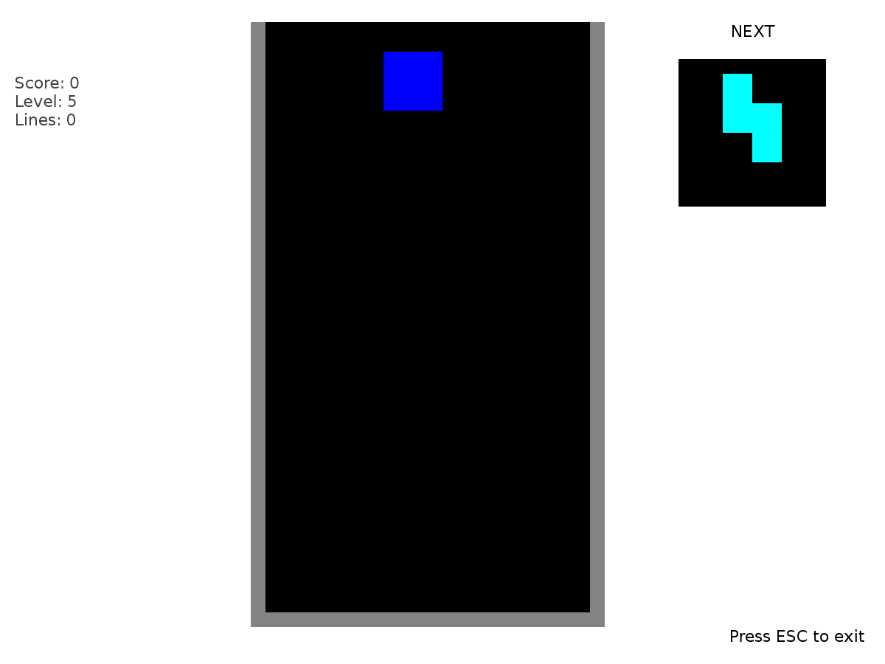
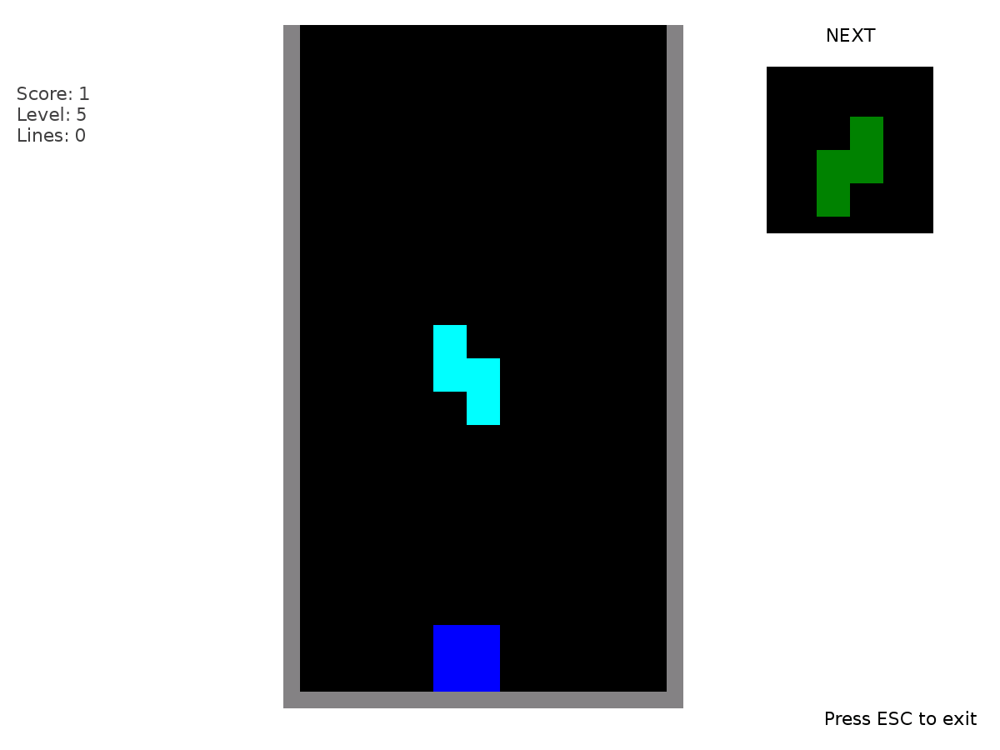
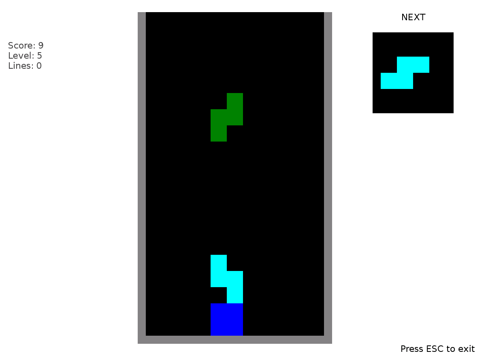
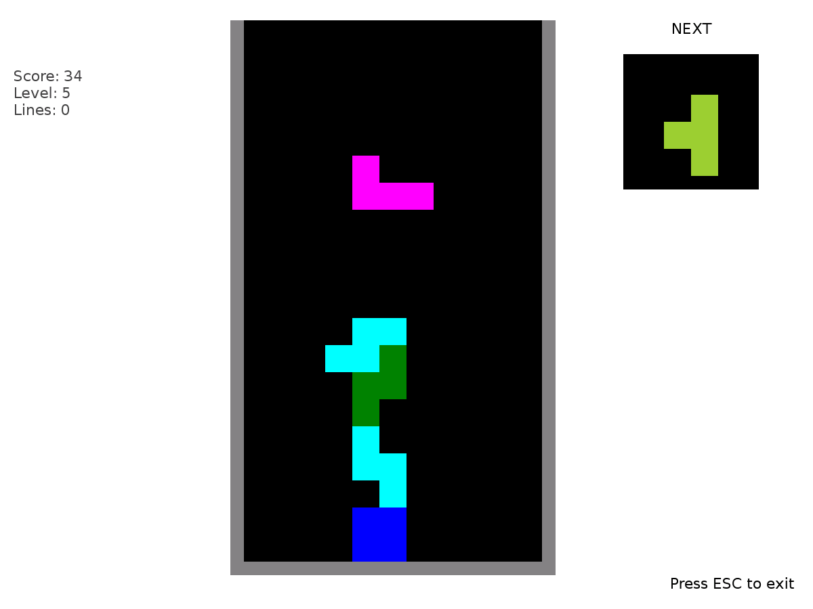

===========
Block Party
===========

Goal
====

Maneuver the falling objects to fall in such a way that they fill a rwo. The rwo will then be deleted. 
Clearing a rwo adds to your score. The game is over when the blocks fill the area and there is no more room for the next block to fall.

Where to get Block Pary
========================

HitTheBalls activity is available for download from the `Sugar Activity Library <http://activities.sugarlabs.org/en-US/sugar/>`__:
`Block Party <http://activities.sugarlabs.org/sugar/addon/4232>`__

The source code is available on `GitHub <https://github.com/sugarlabs/https://github.com/sugarlabs/block-party-activity>`__.

Game phases
===========

Menu screen
-----------

The menu screen, where you select the game level : as soon you click on
one level, the game starts.

Starting the game
----------------

To start the game, press the space bar. The block will begin to fall. While it is falling you can move it 
from side to side with the right and left arrow keys. You can rotate the block by using the up and down arrow keys.

Removing a row
--------------

By maneuvering the blocks as they fall, you can align them side by side. When blocks fill a row, the row is removed. 

Game Over
----------------

As you fill rows, you score points. However, as the game goes on, the level of blocks may rise. When there is no place 
for a new block to enter, the game is over.

Where to report problems
------------------------

Please report bugs and make feature requests at `block-party-activity/issues <https://github.com/sugarlabs/block-party-activity/issues>`__.

